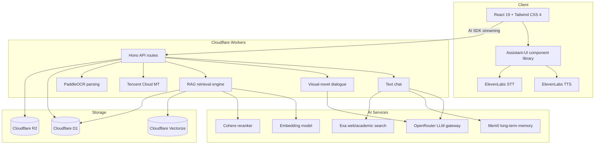

# StudyDojo

**English** | [中文](./README.zh-CN.md)

> 🎓 Turn reading academic papers into an adventure — four AI mentors, three interaction modes (text / voice / visual novel), and a full-stack edge-deployed RAG pipeline.

<p align="center">
  
  
  
  
  
</p>

<p align="center">
  
  
  
  
</p>

<p align="center">
  <a href="https://study-dojo.thebinwang.com/"><strong>👉 Try it now (free, no setup required)</strong></a>
</p>

## 🎬 Demo

<https://github.com/user-attachments/assets/d5993730-fa1c-4878-aff2-86437b52d278>

---

## 📋 Background

Built on **[mad-professor-public](https://github.com/LYiHub/mad-professor-public)** by 「林亦LYi」 — a Python desktop app that wires together PDF parsing, RAG, LLM role-play, and realtime voice as an AI reading companion for papers.

**StudyDojo keeps the core idea, but rebuilds the stack from the ground up** — from a Python desktop app into a cloud-native full-stack Web application, with significant new modes (multi-mentor, visual novel) and infra (two-stage RAG, Mem0, Exa search) on top.

## 💡 Design Notes

### Four mentors instead of one

The original ships a single "Mad Professor". I think learning needs more than one voice — sometimes you need to be yelled at, sometimes encouraged, sometimes just heard. So StudyDojo has four mentors, each with their own personality prompt, voice timbre, and dialogue style:

| Avatar | Name | Style | One-liner |
|:---:|------|-------|-----------|
| ⚡ | **Raiden** | Strict professor | Gruff on the outside, secretly invested — quick to assign "you'll be copying this entire paper" |
| 💥 | **Klee** | Bomb expert | Explains papers with explosives. Learning can be ridiculously fun |
| 🌸 | **Shiyu** | Empathetic senior | Patient, kind — the "no question is too small" mentor |
| 📐 | **Yixuan** | Concept decoder | Grounded, great at breaking complex ideas into pieces a beginner can hold |

### Three modes sharing one conversation

The original is mostly text + voice. StudyDojo adds **Visual Novel mode** — reading a paper like a story-driven game, with character portraits, expression changes, RPG dialogue options, and 16 visual effects. All three modes share state — switch freely:

| Mode | Feels like | Best for |
|------|-----------|---------|
| 💬 **Text** | Classic AI chat with tool use, syntax highlighting, reasoning trails | Close reading, deep questioning |
| 🎙️ **Voice** | Realtime voice with interruption support — closer to talking to a human | Commuting, hands-free study |
| 🎬 **Visual Novel** | Portraits + expressions + dialogue choices + effects | Lighthearted exploration |

### What else got built on top

- 🔍 **Two-stage RAG** — vector recall + Cohere reranking; materially more precise than vector-only retrieval
- 🌐 **Live web + paper search** — Exa API for real-time sources, with citations
- 🧠 **Long-term memory** — Mem0 retains preferences across sessions ("remember I prefer skipping math derivations")
- 📄 **Multi-format ingest** — PDF / DOCX / DOC / images / TXT / MD parsed, translated, vectorized
- 🛠️ **Interactive tool cards** — retrieval suggestions and user-confirmation render as visual cards, not bare function calls

---

## 🏗️ System Architecture



---

## 🚀 Use it online

Open the browser, sign up, you're in. No install, no env vars, no server:

**👉 [study-dojo.thebinwang.com](https://study-dojo.thebinwang.com/)**

To run it locally or fork the code, keep reading 👇

## 🛠️ Local Development

**Requires** Node.js 20+, PNPM 9+, and a Cloudflare account with D1 / R2 / Vectorize enabled.

```bash
git clone https://github.com/BingoWon/study-dojo.git
cd study-dojo
pnpm install
cp .dev.vars.example .dev.vars     # fill in service credentials — see below

# First-run only: provision Cloudflare resources
npx wrangler d1 create study-dojo-db
npx wrangler r2 bucket create study-dojo-papers
npx wrangler vectorize create knowledge-index --dimensions 1536 --metric cosine
# Drop the generated IDs into wrangler.toml

pnpm dev      # local dev server
pnpm deploy   # build + deploy to Cloudflare
pnpm check    # lint + type check
```

## ⚙️ Environment Variables

Configure in `.dev.vars` for local development. For production, use `wrangler secret put <NAME>`.

### LLM

| Variable | Description |
|----------|-------------|
| `LLM_BASE_URL` | Primary model endpoint (e.g. `https://openrouter.ai/api/v1`) |
| `LLM_API_KEY` | Primary model API key |
| `LLM_MODEL` | Text chat model (e.g. `anthropic/claude-sonnet-4`) |
| `DIALOGUE_BASE_URL` / `DIALOGUE_API_KEY` / `DIALOGUE_MODEL` | Optional override for visual-novel mode (defaults to primary) |
| `EMBEDDING_BASE_URL` / `EMBEDDING_API_KEY` / `EMBEDDING_MODEL` | Embedding service (e.g. `qwen/qwen3-embedding-4b`) |
| `RERANK_MODEL` | Reranker (e.g. `cohere/rerank-4-fast`) |

### Services

| Variable | Description |
|----------|-------------|
| `PADDLE_OCR_TOKEN` | PaddleOCR — PDF and image parsing |
| `TMT_SECRET_ID` / `TMT_SECRET_KEY` | Tencent Cloud MT — auto-translation of English documents |
| `ELEVENLABS_API_KEY` | ElevenLabs — TTS and STT |
| `EXA_API_KEY` | Exa — web + academic paper search |
| `MEM0_API_KEY` | Mem0 — cross-session memory |
| `CLERK_JWKS_URL` / `VITE_CLERK_PUBLISHABLE_KEY` | Clerk authentication |

## 🛠️ Tech Stack

| Layer | Tech |
|-------|------|
| **Frontend** | React 19, TypeScript, Tailwind CSS 4, Assistant-UI, Vite 8 |
| **Backend** | Cloudflare Workers, Hono, Vercel AI SDK |
| **Database** | Cloudflare D1 (SQLite), Drizzle ORM |
| **Vector / Object store** | Cloudflare Vectorize, Cloudflare R2 |
| **LLM gateway** | OpenRouter (OpenAI-compatible) |
| **Voice / Search / Memory** | ElevenLabs (TTS+STT), Exa, Mem0 |
| **Auth** | Clerk |
| **Tooling** | Biome (lint + format) |

## 🤝 Contributing

Issues and pull requests welcome — bug fixes, new features, doc improvements, all of it. Got an idea for a new mentor character? Open an issue and let's discuss 💬

Not into code? Just go to the [live version](https://study-dojo.thebinwang.com/) and try it.
