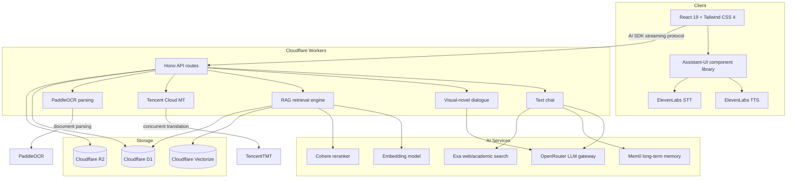
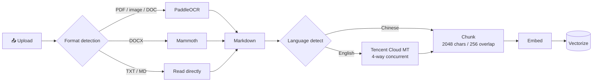

# StudyDojo

**English** | [中文](./README.zh-CN.md)

> 🎓 Turn reading academic papers into an adventure — four AI mentors, three interaction modes (text / voice / visual novel), and a full-stack edge-deployed RAG pipeline.

<p align="center">
  
  
  
  
  
</p>

<p align="center">
  
  
  
  
</p>

<p align="center">
  <a href="https://study-dojo.thebinwang.com/"><strong>👉 Try it now (free, no setup required)</strong></a>
</p>

## 🎬 Demo

<https://github.com/user-attachments/assets/d5993730-fa1c-4878-aff2-86437b52d278>

---

## 📋 Project Background

This project builds on **[mad-professor-public](https://github.com/LYiHub/mad-professor-public)** by the open-source channel 「林亦LYi」. The original is a desktop application that wires together PDF parsing, RAG, LLM role-play, and realtime voice — designed as an AI reading companion for academic papers.

**StudyDojo takes that foundation in a different direction: feature extension + full rearchitecture.** The original's core ideas (RAG retrieval, character role-play, voice interaction) are preserved, but the entire stack has been redesigned from the ground up — moving from a Python desktop app to a cloud-native full-stack Web application, with significant new capabilities layered on top.

## 💡 Design Notes

### From one professor to a four-mentor team

The original project has a single "Mad Professor". I think learning needs more than one voice — sometimes you need to be yelled at, sometimes you need encouragement, and sometimes you just want someone patient to listen to "I don't understand this part". So StudyDojo ships with four mentors, each with their own personality prompts, voice timbre, and dialogue style:

| Avatar | Name | Style | One-liner |
|:---:|------|-------|-----------|
| ⚡ | **Raiden** | The strict professor | Gruff on the outside, secretly invested — quick to assign "you'll be copying this entire paper as punishment" |
| 💥 | **Klee** | The bomb expert | The energetic kid who explains papers with explosives. Learning can be ridiculously fun |
| 🌸 | **Shiyu** | The empathetic senior | Patient, kind, never makes you feel dumb for asking — the "no question is too small" mentor |
| 📐 | **Yixuan** | The concept decoder | The grounded senior who's great at breaking complex ideas into pieces a beginner can hold |

### From text chat to three immersive modes

The original is mostly text + voice. StudyDojo adds a **Visual Novel mode** — reading a paper like you're playing a story-driven game. Mentors appear with character portraits and expression changes, RPG-style dialogue options nudge you through the paper, and 16 visual effects (fireworks, lightning, explosions, glitches, rain…) fire on key beats.

All three modes share state and conversation history — you can switch on the fly:

| Mode | What it feels like | Best for |
|------|--------------------|---------|
| 💬 **Text** | Classic AI chat with tool use, syntax highlighting, and reasoning trails | Close reading, deep questioning |
| 🎙️ **Voice** | Realtime voice with interruption support — closer to talking to a human | Commuting, hands-free study |
| 🎬 **Visual Novel** | Character portraits + expressions + dialogue choices + effects | Lighthearted exploration, fun mode |

### From a local tool to a full-stack edge platform

The original is a Python desktop app. StudyDojo rebuilds the entire stack as a **full-stack Web application** deployed on Cloudflare's edge network — open a browser and you're in, nothing to install:

- **Frontend**: React 19 + Tailwind CSS 4 + Assistant-UI
- **Backend**: Cloudflare Workers + Hono + Vercel AI SDK
- **Storage**: D1 (relational) + R2 (objects) + Vectorize (embeddings)
- **Global delivery**: Cloudflare edge nodes route to the nearest region automatically

### What else I built on top

- 🔍 **Two-stage RAG** — vector recall followed by Cohere reranking, materially more precise than vector-only retrieval
- 🌐 **Live web search** — Exa API for real-time web + academic paper search with verifiable sources
- 🧠 **Long-term memory** — Mem0 retains user preferences across sessions ("remember that I prefer skipping math derivations")
- 📄 **Multi-format document pipeline** — PDF / DOCX / DOC / images / TXT / MD, parsed, translated, and vectorized automatically
- 🛠️ **Interactive tool cards** — document-retrieval suggestions and user-confirmation steps render as visual cards, not bare function calls
- 🎨 **16 visual effects** — fireworks, lightning, bombs, vortexes, glitches, rain… exclusive to visual-novel mode
- 🔐 **Authentication** — Clerk login; every user gets isolated conversation history and document library

---

## 🏗️ System Architecture



## 📄 Document Processing Pipeline



---

## 🚀 Use it online

Fastest path — open the browser, sign up, you're in. Free, no setup:

**👉 [https://study-dojo.thebinwang.com/](https://study-dojo.thebinwang.com/)**

No install, no env vars, no server. Sign up, upload a paper, pick a mentor, start reading.

If you'd rather run it locally or fork the code, keep reading 👇

---

## 🛠️ Local Development

### Requirements

- Node.js 20+
- PNPM 9+
- A Cloudflare account with D1, R2, and Vectorize enabled

### Quick start

```bash
# 1. Clone
git clone https://github.com/BingoWon/study-dojo.git
cd study-dojo

# 2. Install
pnpm install

# 3. Configure env vars
cp .dev.vars.example .dev.vars
# Edit .dev.vars and fill in service credentials (see below)

# 4. Provision Cloudflare resources (first run only)
npx wrangler d1 create study-dojo-db
npx wrangler r2 bucket create study-dojo-papers
npx wrangler vectorize create knowledge-index --dimensions 1536 --metric cosine
# Drop the generated IDs into the right spots in wrangler.toml

# 5. Start the dev server
pnpm dev
```

### Common commands

| Command | What it does |
|---------|--------------|
| `pnpm dev` | Start the local dev server |
| `pnpm build` | Production build |
| `pnpm deploy` | Build and deploy to Cloudflare |
| `pnpm check` | Run linting and type checking |
| `pnpm cf-typegen` | Generate Cloudflare type definitions |

## ⚙️ Environment Variables

Configure these in `.dev.vars` locally. In production, set them with `wrangler secret put <NAME>`.

### Core LLM

| Variable | Description | Example |
|----------|-------------|---------|
| `LLM_BASE_URL` | Primary model API endpoint | `https://openrouter.ai/api/v1` |
| `LLM_API_KEY` | Primary model API key | `sk-or-v1-xxx` |
| `LLM_MODEL` | Model used for text chat | `anthropic/claude-sonnet-4` |
| `DIALOGUE_BASE_URL` | Visual-novel mode endpoint (optional, defaults to primary) | same as above |
| `DIALOGUE_API_KEY` | Visual-novel mode API key (optional) | same as above |
| `DIALOGUE_MODEL` | Visual-novel mode model (optional) | `google/gemini-2.5-flash` |

### Retrieval & reranking

| Variable | Description |
|----------|-------------|
| `EMBEDDING_BASE_URL` | Embedding service endpoint |
| `EMBEDDING_API_KEY` | Embedding API key |
| `EMBEDDING_MODEL` | Embedding model (e.g. `qwen/qwen3-embedding-4b`) |
| `RERANK_MODEL` | Reranker model (e.g. `cohere/rerank-4-fast`) |

### Document processing

| Variable | Description |
|----------|-------------|
| `PADDLE_OCR_TOKEN` | PaddleOCR token for PDF and image parsing |
| `TMT_SECRET_ID` | Tencent Cloud MT SecretId for auto-translation of English documents |
| `TMT_SECRET_KEY` | Tencent Cloud MT SecretKey |

### Voice

| Variable | Description |
|----------|-------------|
| `ELEVENLABS_API_KEY` | ElevenLabs API key for both TTS and STT |

### Web search & long-term memory

| Variable | Description |
|----------|-------------|
| `EXA_API_KEY` | Exa search API key for web + academic paper retrieval |
| `MEM0_API_KEY` | Mem0 API key for cross-session memory |

### Auth

| Variable | Description |
|----------|-------------|
| `CLERK_JWKS_URL` | Clerk JWKS endpoint |
| `VITE_CLERK_PUBLISHABLE_KEY` | Clerk frontend publishable key |

## 🛠️ Tech Stack

| Layer | Tech |
|-------|------|
| **Frontend** | React 19, TypeScript, Tailwind CSS 4, Assistant-UI, Vite 8 |
| **Backend** | Cloudflare Workers, Hono, Vercel AI SDK |
| **Database** | Cloudflare D1 (SQLite), Drizzle ORM |
| **Vector store** | Cloudflare Vectorize |
| **Object storage** | Cloudflare R2 |
| **LLM gateway** | OpenRouter (OpenAI-compatible) |
| **Voice** | ElevenLabs (TTS + STT) |
| **Search** | Exa (web + academic papers) |
| **Memory** | Mem0 (long-term memory management) |
| **Auth** | Clerk |
| **Code style** | Biome (lint + format) |

## 🤝 Contributing

Issues and pull requests welcome — bug fixes, new features, doc improvements, all of it.

1. Fork the repo
2. Create your branch: `git checkout -b feat/my-feature`
3. Commit your changes: `git commit -m "feat: add my feature"`
4. Push the branch: `git push origin feat/my-feature`
5. Open a Pull Request

Got an idea for a new mentor character or feature? Open an issue and let's discuss 💬

Not in the mood to deal with code? Just go to the [live version](https://study-dojo.thebinwang.com/) and try it.
