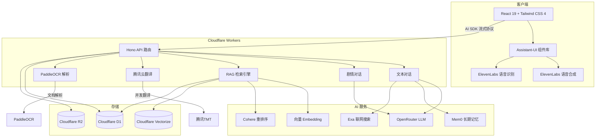
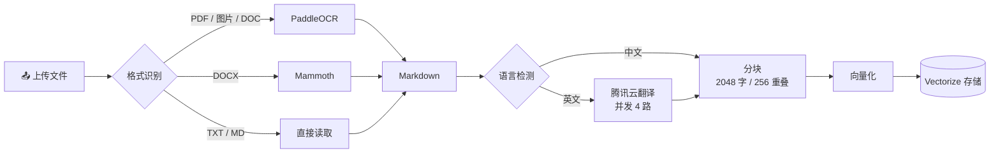

# StudyDojo 学乐园

> 🎓 让读论文变成一场冒险 —— 四位 AI 导师，文字 / 语音 / 剧情三种模式，陪你把论文啃穿。

<p align="center">
  
  
  
  
</p>

---

## 📋 项目背景

本项目基于「林亦LYi」频道的开源项目 [暴躁教授论文陪读](https://github.com/LYiHub/mad-professor-public) 进行二次开发。原项目是一个集成了 PDF 解析、RAG、LLM 角色扮演和实时语音交互的桌面应用，旨在作为学术论文的 AI 阅读伴侣。

**StudyDojo 选择的方向是「特性增强 + 模块重组」双线并行**：保留原项目 RAG 检索 + 角色扮演 + 语音交互的核心思路，同时从零开始重新设计架构，将桌面应用重构为云端全栈 Web 应用，并在此基础上做了大量创新扩展。

## 💡 创意说明

### 从一个角色到一支教学天团

原项目只有一位"暴躁教授"。我觉得学习这件事，不同场景需要不同的陪伴：有时需要被骂醒，有时需要被鼓励，有时只想找个人耐心听你说"这段没看懂"。所以我设计了四位风格迥异的 AI 导师，每位都有独立的人设提示词、语音音色和对话风格：

| 角色 | 名称 | 风格 | 一句话介绍 |
|:---:|------|------|-----------|
| ⚡ | **雷电教授** | 学术暴君 | 嘴上凶巴巴但内心敦促你进步的严师，动不动就"罚你抄写整篇论文" |
| 💥 | **可莉导师** | 爆炸专家 | 用蹦蹦炸弹给你讲论文的元气少女，学习也可以超级有趣 |
| 🌸 | **诗雨学姐** | 解忧百科 | 温柔耐心的知心学姐，再笨的问题她都不会嫌你烦 |
| 📐 | **逸轩学长** | 论文翻译官 | 务实靠谱的理工男，擅长把复杂概念掰开揉碎讲给你听 |

### 从文字聊天到三种沉浸体验

原项目以文字 + 语音为主。我额外引入了**剧情伴读模式**——像玩视觉小说一样读论文。AI 导师会带着立绘和表情变化，用 RPG 对话选项引导你探索论文，偶尔还会触发庆祝烟花、闪电、炸弹爆炸等 16 种视觉特效。

三种模式可以无缝切换，对话历史在模式之间自动合并：

| 模式 | 体验 | 适合场景 |
|------|------|---------|
| 💬 **文字模式** | 传统 AI 对话，支持工具调用、代码高亮、推理可视化 | 精读细节、深度提问 |
| 🎙️ **语音模式** | 实时语音对话，支持打断，像和真人讨论 | 通勤路上、解放双手 |
| 🎬 **剧情模式** | 视觉小说风格，角色立绘 + 表情 + 选项 + 特效 | 轻松探索、趣味学习 |

### 从本地工具到云端全栈

原项目是基于 Python 的桌面应用。我将整个架构重构为**全栈 Web 应用**，部署在 Cloudflare 边缘网络上，打开浏览器就能用，无需安装任何软件：

- **前端**：React 19 + Tailwind CSS 4 + Assistant-UI 组件库
- **后端**：Cloudflare Workers + Hono + Vercel AI SDK
- **存储**：D1（关系数据）+ R2（文档对象）+ Vectorize（向量检索）
- **全球部署**：Cloudflare 边缘节点自动就近响应

### 除此之外还折腾了什么

- 🔍 **两阶段 RAG**：向量召回 + Cohere 重排序，比单纯向量检索更精准
- 🌐 **联网搜索**：Exa API 实时搜网页和学术论文，引用真实来源
- 🧠 **长期记忆**：Mem0 记住用户偏好，跨会话生效（"记住我不喜欢看公式推导"）
- 📄 **多格式文档库**：PDF / DOCX / DOC / 图片 / TXT / MD，自动解析翻译向量化
- 🛠️ **交互式工具卡片**：文档检索建议、用户提问确认等通过可视化卡片完成，不是冷冰冰的函数调用
- 🎨 **16 种视觉特效**：烟花、闪电、炸弹爆炸、漩涡、故障、下雨……剧情模式专属彩蛋
- 🔐 **用户认证**：Clerk 登录，每个用户有独立的对话历史和文档库

---

## 🏗️ 系统架构



## 📄 文档处理流水线



---

## 🚀 安装与运行

### 环境要求

- Node.js 20+
- PNPM 9+
- Cloudflare 账号（需开通 D1、R2、Vectorize 服务）

### 快速开始

```bash
# 1. 克隆项目
git clone https://github.com/BingoWon/study-dojo.git
cd study-dojo

# 2. 安装依赖
pnpm install

# 3. 配置环境变量
cp .dev.vars.example .dev.vars
# 编辑 .dev.vars，填入各服务的密钥（详见下方说明）

# 4. 初始化 Cloudflare 资源（首次运行）
npx wrangler d1 create study-dojo-db
npx wrangler r2 bucket create study-dojo-papers
npx wrangler vectorize create knowledge-index --dimensions 1536 --metric cosine
# 将生成的 ID 填入 wrangler.toml 对应位置

# 5. 启动开发服务器
pnpm dev
```

### 常用命令

| 命令 | 说明 |
|------|------|
| `pnpm dev` | 启动本地开发服务器 |
| `pnpm build` | 构建生产版本 |
| `pnpm deploy` | 构建并部署到 Cloudflare |
| `pnpm check` | 运行代码检查（lint + 类型检查） |
| `pnpm cf-typegen` | 生成 Cloudflare 类型定义 |

## ⚙️ 环境变量

在 `.dev.vars` 中配置以下变量。生产环境通过 `wrangler secret put <变量名>` 设置。

### 核心 LLM

| 变量 | 说明 | 示例 |
|------|------|------|
| `LLM_BASE_URL` | 主模型 API 地址 | `https://openrouter.ai/api/v1` |
| `LLM_API_KEY` | 主模型 API 密钥 | `sk-or-v1-xxx` |
| `LLM_MODEL` | 文本对话使用的模型 | `anthropic/claude-sonnet-4` |
| `DIALOGUE_BASE_URL` | 剧情模式 API 地址（可选，默认同主模型） | 同上 |
| `DIALOGUE_API_KEY` | 剧情模式 API 密钥（可选） | 同上 |
| `DIALOGUE_MODEL` | 剧情模式使用的模型（可选） | `google/gemini-2.5-flash` |

### 向量检索与重排序

| 变量 | 说明 |
|------|------|
| `EMBEDDING_BASE_URL` | Embedding 服务地址 |
| `EMBEDDING_API_KEY` | Embedding API 密钥 |
| `EMBEDDING_MODEL` | Embedding 模型（如 `qwen/qwen3-embedding-4b`） |
| `RERANK_MODEL` | 重排序模型（如 `cohere/rerank-4-fast`） |

### 文档处理

| 变量 | 说明 |
|------|------|
| `PADDLE_OCR_TOKEN` | PaddleOCR 服务 Token，用于 PDF 和图片解析 |
| `TMT_SECRET_ID` | 腾讯云翻译 SecretId，用于英文文档自动翻译 |
| `TMT_SECRET_KEY` | 腾讯云翻译 SecretKey |

### 语音交互

| 变量 | 说明 |
|------|------|
| `ELEVENLABS_API_KEY` | ElevenLabs API 密钥，用于语音合成和语音识别 |

### 联网搜索与长期记忆

| 变量 | 说明 |
|------|------|
| `EXA_API_KEY` | Exa 搜索 API 密钥，用于联网搜索和学术论文检索 |
| `MEM0_API_KEY` | Mem0 API 密钥，用于跨会话长期记忆 |

### 用户认证

| 变量 | 说明 |
|------|------|
| `CLERK_JWKS_URL` | Clerk JWKS 端点地址 |
| `VITE_CLERK_PUBLISHABLE_KEY` | Clerk 前端可公开密钥 |

## 🛠️ 技术栈

| 层 | 技术 |
|---|------|
| **前端** | React 19、TypeScript、Tailwind CSS 4、Assistant-UI、Vite 8 |
| **后端** | Cloudflare Workers、Hono、Vercel AI SDK |
| **数据库** | Cloudflare D1（SQLite）、Drizzle ORM |
| **向量库** | Cloudflare Vectorize |
| **对象存储** | Cloudflare R2 |
| **LLM 网关** | OpenRouter（兼容任意 OpenAI 接口） |
| **语音** | ElevenLabs（TTS + STT） |
| **搜索** | Exa（网页 + 学术论文） |
| **记忆** | Mem0（长期记忆管理） |
| **认证** | Clerk |
| **代码规范** | Biome（lint + format） |

## 🤝 参与贡献

欢迎提交 Issue 和 Pull Request！无论是修 Bug、加功能还是改文档，都非常欢迎。

1. Fork 本仓库
2. 创建你的分支：`git checkout -b feat/my-feature`
3. 提交改动：`git commit -m "feat: add my feature"`
4. 推送分支：`git push origin feat/my-feature`
5. 发起 Pull Request

如果你有好的角色创意或功能建议，也欢迎在 Issues 中讨论 💬
