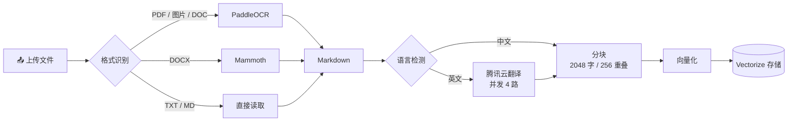

# StudyDojo 学乐园

> 🎓 让读论文变成一场冒险 —— 多角色 AI 学术伴读，带语音、带剧情、带吐槽。

还在一个人硬啃论文？StudyDojo 给你安排了四位性格迥异的 AI 导师，从严厉的雷电教授到活泼的可莉导师，陪你在知识的海洋里畅游。上传论文、选个角色、开聊就行——文字、语音、剧情三种模式随心切换。

## ✨ 亮点

- 🎭 **四位 AI 导师**，各有人设和声线，不是冷冰冰的问答机器
- 🎙️ **语音伴读**，像真人对话一样讨论论文，支持打断和实时语音识别
- 🎬 **剧情模式**，视觉小说风格的对话体验，带立绘、表情和视觉特效
- 📄 **智能文档库**，上传 PDF / DOCX / 图片等格式，自动解析、翻译、向量化
- 🔍 **RAG 语义检索**，两阶段召回 + 重排序，精准定位论文内容
- 🧠 **长期记忆**，记住你的偏好和学习进度，跨会话持续生效
- 🌐 **联网搜索**，实时查论文、查资料，引用真实来源
- 🛠️ **交互式工具卡片**，文档检索、用户提问等操作通过可视化卡片完成

## 🎭 四位导师

| 角色 | 名称 | 风格 | 一句话介绍 |
|:---:|------|------|-----------|
| ⚡ | **雷电教授** | 学术暴君 | 嘴上凶巴巴但内心敦促你进步的严师，动不动就罚你抄论文 |
| 💥 | **可莉导师** | 爆炸专家 | 用蹦蹦炸弹给你讲论文的元气少女，学习也可以超级有趣 |
| 🌸 | **诗雨学姐** | 解忧百科 | 温柔耐心的知心学姐，再笨的问题她都不会嫌你烦 |
| 📐 | **逸轩学长** | 论文翻译官 | 务实靠谱的理工男，擅长把复杂概念掰开揉碎讲给你听 |

## 🏗️ 系统架构


## 📄 文档处理流水线



## 🚀 快速开始

### 环境要求

- Node.js 20+
- PNPM 9+
- Cloudflare 账号（D1、R2、Vectorize）

### 安装与运行

```bash
# 克隆项目
git clone https://github.com/BingoWon/study-dojo.git
cd study-dojo

# 安装依赖
pnpm install

# 复制环境变量模板
cp .dev.vars.example .dev.vars
# 编辑 .dev.vars 填入你的密钥

# 启动开发服务器
pnpm dev
```

### 常用命令

| 命令 | 说明 |
|------|------|
| `pnpm dev` | 启动本地开发服务器 |
| `pnpm build` | 构建生产版本 |
| `pnpm deploy` | 构建并部署到 Cloudflare |
| `pnpm check` | 运行代码检查（lint + 类型检查） |
| `pnpm cf-typegen` | 生成 Cloudflare 类型定义 |

## ⚙️ 环境变量

在 `.dev.vars` 中配置以下变量，生产环境通过 `wrangler secret put` 设置。

### 核心 LLM

| 变量 | 说明 | 示例 |
|------|------|------|
| `LLM_BASE_URL` | 主模型 API 地址 | `https://openrouter.ai/api/v1` |
| `LLM_API_KEY` | 主模型 API 密钥 | `sk-or-v1-xxx` |
| `LLM_MODEL` | 文本对话模型 ID | `anthropic/claude-sonnet-4` |
| `DIALOGUE_BASE_URL` | 剧情模式 API 地址（可选，默认同主模型） | 同上 |
| `DIALOGUE_API_KEY` | 剧情模式 API 密钥（可选） | 同上 |
| `DIALOGUE_MODEL` | 剧情模式模型 ID（可选） | `google/gemini-2.5-flash` |

### 向量检索

| 变量 | 说明 |
|------|------|
| `EMBEDDING_BASE_URL` | Embedding 服务地址 |
| `EMBEDDING_API_KEY` | Embedding API 密钥 |
| `EMBEDDING_MODEL` | Embedding 模型 ID |
| `RERANK_MODEL` | 重排序模型 ID（如 `cohere/rerank-4-fast`） |

### 文档处理

| 变量 | 说明 |
|------|------|
| `PADDLE_OCR_TOKEN` | PaddleOCR 服务 Token（PDF/图片解析） |
| `TMT_SECRET_ID` | 腾讯云翻译 SecretId（英→中翻译） |
| `TMT_SECRET_KEY` | 腾讯云翻译 SecretKey |

### 语音

| 变量 | 说明 |
|------|------|
| `ELEVENLABS_API_KEY` | ElevenLabs API 密钥（语音合成 + 识别） |

### 搜索与记忆

| 变量 | 说明 |
|------|------|
| `EXA_API_KEY` | Exa 搜索 API 密钥（联网搜索 + 论文检索） |
| `MEM0_API_KEY` | Mem0 API 密钥（长期记忆） |

### 用户认证

| 变量 | 说明 |
|------|------|
| `CLERK_JWKS_URL` | Clerk JWKS 端点 |
| `VITE_CLERK_PUBLISHABLE_KEY` | Clerk 前端公钥 |

## 🛠️ 技术栈

| 层 | 技术 |
|---|------|
| **前端** | React 19、TypeScript、Tailwind CSS 4、Assistant-UI、Vite 8 |
| **后端** | Cloudflare Workers、Hono、Vercel AI SDK |
| **数据库** | Cloudflare D1（SQLite）、Drizzle ORM |
| **向量库** | Cloudflare Vectorize |
| **对象存储** | Cloudflare R2 |
| **LLM 网关** | OpenRouter（兼容任意 OpenAI 接口） |
| **语音** | ElevenLabs（TTS + STT） |
| **搜索** | Exa（网页 + 学术论文） |
| **记忆** | Mem0（长期记忆管理） |
| **认证** | Clerk |
| **代码规范** | Biome（lint + format） |

## 🤝 参与贡献

欢迎提交 Issue 和 Pull Request！无论是修 Bug、加功能还是改文档，都非常欢迎。

1. Fork 本仓库
2. 创建你的分支：`git checkout -b feat/my-feature`
3. 提交改动：`git commit -m "feat: add my feature"`
4. 推送分支：`git push origin feat/my-feature`
5. 发起 Pull Request

如果你有好的角色创意或功能建议，也欢迎在 Issues 中讨论 💬
