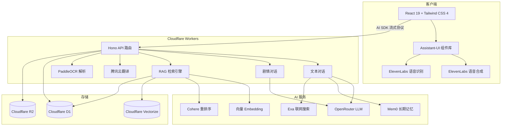

# StudyDojo 学乐园

[English](./README.md) | **中文**

> 🎓 让读论文变成一场冒险——四位 AI 导师，文字 / 语音 / 剧情三种模式，边缘部署的全栈 RAG 管线陪你把论文啃穿。

<p align="center">
  <a href="https://github.com/BingoWon/study-dojo/actions/workflows/ci.yml"></a>
  
  
  
  
  
</p>

<p align="center">
  
  
  
  
</p>

<p align="center">
  <a href="https://study-dojo.thebinwang.com/"><strong>👉 立即体验（完全免费，无需部署）</strong></a>
</p>

## 🎬 演示视频

<https://github.com/user-attachments/assets/d5993730-fa1c-4878-aff2-86437b52d278>

---

## 📋 项目背景

本项目基于「林亦LYi」的 [暴躁教授论文陪读](https://github.com/LYiHub/mad-professor-public)——一个 Python 桌面应用，集成 PDF 解析、RAG、LLM 角色扮演和实时语音，作为论文阅读的 AI 伴侣。

**StudyDojo 保留核心思路，但从零重建整个技术栈**——从 Python 桌面应用重构为云端全栈 Web 应用，并在此之上加入多导师、剧情模式等新交互，以及两阶段 RAG、Mem0 长期记忆、Exa 联网搜索等新基础设施。

## 💡 设计说明

### 从一位教授到四位导师

原项目只有一位"暴躁教授"。我觉得学习这件事，不同场景需要不同的陪伴——有时被骂醒，有时被鼓励，有时只需要一个耐心听众。所以 StudyDojo 配置了四位风格迥异的导师，每位都有独立的人设提示词、语音音色和对话风格：

| 角色 | 名称 | 风格 | 一句话介绍 |
|:---:|------|------|-----------|
| ⚡ | **雷电教授** | 学术暴君 | 嘴上凶巴巴但内心敦促你进步，动不动"罚你抄整篇论文" |
| 💥 | **可莉导师** | 爆炸专家 | 用蹦蹦炸弹给你讲论文的元气少女，学习也可以超级有趣 |
| 🌸 | **诗雨学姐** | 解忧百科 | 温柔耐心的知心学姐，再笨的问题她都不会嫌你烦 |
| 📐 | **逸轩学长** | 论文翻译官 | 务实靠谱的理工男，擅长把复杂概念掰开揉碎讲给你听 |

### 三种模式共享同一段对话

原项目以文字 + 语音为主。StudyDojo 引入**剧情伴读模式**——像玩视觉小说一样读论文，角色立绘 + 表情变化 + RPG 对话选项 + 16 种视觉特效。三种模式状态共享，可自由切换：

| 模式 | 体验 | 适合场景 |
|------|------|---------|
| 💬 **文字模式** | 传统 AI 对话，支持工具调用、代码高亮、推理可视化 | 精读细节、深度提问 |
| 🎙️ **语音模式** | 实时语音对话，支持打断——更像和真人讨论 | 通勤路上、解放双手 |
| 🎬 **剧情模式** | 视觉小说风格，角色立绘 + 表情 + 选项 + 特效 | 轻松探索、趣味学习 |

### 除此之外还折腾了什么

- 🔍 **两阶段 RAG** — 向量召回 + Cohere 重排序，比单纯向量检索更精准
- 🌐 **联网与论文搜索** — Exa API 实时搜网页和学术论文，引用真实来源
- 🧠 **长期记忆** — Mem0 跨会话记住用户偏好（"记住我不喜欢看公式推导"）
- 📄 **多格式文档库** — PDF / DOCX / DOC / 图片 / TXT / MD，自动解析、翻译、向量化
- 🛠️ **交互式工具卡片** — 文档检索建议、用户提问确认等通过可视化卡片呈现，不是冷冰冰的函数调用

---

## 🏗️ 系统架构



---

## 🚀 在线使用

打开浏览器，注册即用，无需安装、无需配置、无需部署：

**👉 [study-dojo.thebinwang.com](https://study-dojo.thebinwang.com/)**

如果想本地开发或二次开发，请继续往下看 👇

## 🛠️ 本地开发

**需要** Node.js 20+、PNPM 9+，以及开通了 D1 / R2 / Vectorize 服务的 Cloudflare 账号。

```bash
git clone https://github.com/BingoWon/study-dojo.git
cd study-dojo
pnpm install
cp .dev.vars.example .dev.vars     # 填入各服务密钥——见下方说明

# 首次运行：初始化 Cloudflare 资源
npx wrangler d1 create study-dojo-db
npx wrangler r2 bucket create study-dojo-papers
npx wrangler vectorize create knowledge-index --dimensions 1536 --metric cosine
# 将生成的 ID 填入 wrangler.toml 对应位置

pnpm dev      # 本地开发服务器
pnpm deploy   # 构建 + 部署到 Cloudflare
pnpm check    # 代码检查 + 类型检查
```

## ⚙️ 环境变量

本地通过 `.dev.vars` 配置；生产环境用 `wrangler secret put <变量名>`。

### LLM

| 变量 | 说明 |
|------|------|
| `LLM_BASE_URL` | 主模型 API 地址（如 `https://openrouter.ai/api/v1`） |
| `LLM_API_KEY` | 主模型 API 密钥 |
| `LLM_MODEL` | 文本对话模型（如 `anthropic/claude-sonnet-4`） |
| `DIALOGUE_BASE_URL` / `DIALOGUE_API_KEY` / `DIALOGUE_MODEL` | 剧情模式可选覆盖（默认沿用主模型） |
| `EMBEDDING_BASE_URL` / `EMBEDDING_API_KEY` / `EMBEDDING_MODEL` | Embedding 服务（如 `qwen/qwen3-embedding-4b`） |
| `RERANK_MODEL` | 重排序模型（如 `cohere/rerank-4-fast`） |

### 服务

| 变量 | 说明 |
|------|------|
| `PADDLE_OCR_TOKEN` | PaddleOCR——PDF 和图片解析 |
| `TMT_SECRET_ID` / `TMT_SECRET_KEY` | 腾讯云翻译——英文文档自动翻译 |
| `ELEVENLABS_API_KEY` | ElevenLabs——语音合成与识别 |
| `EXA_API_KEY` | Exa——网页与学术论文检索 |
| `MEM0_API_KEY` | Mem0——跨会话记忆 |
| `CLERK_JWKS_URL` / `VITE_CLERK_PUBLISHABLE_KEY` | Clerk 用户认证 |

## 🛠️ 技术栈

| 层 | 技术 |
|---|------|
| **前端** | React 19、TypeScript、Tailwind CSS 4、Assistant-UI、Vite 8 |
| **后端** | Cloudflare Workers、Hono、Vercel AI SDK |
| **数据库** | Cloudflare D1（SQLite）、Drizzle ORM |
| **向量 / 对象存储** | Cloudflare Vectorize、Cloudflare R2 |
| **LLM 网关** | OpenRouter（兼容 OpenAI 接口） |
| **语音 / 搜索 / 记忆** | ElevenLabs（TTS+STT）、Exa、Mem0 |
| **认证** | Clerk |
| **工具链** | Biome（lint + format） |

## 🤝 参与贡献

欢迎提交 Issue 和 Pull Request——修 Bug、加功能、改文档都非常欢迎。如果你有好的角色创意或功能建议，也欢迎在 Issues 中讨论 💬

不想折腾代码？直接到[在线版](https://study-dojo.thebinwang.com/)体验。
